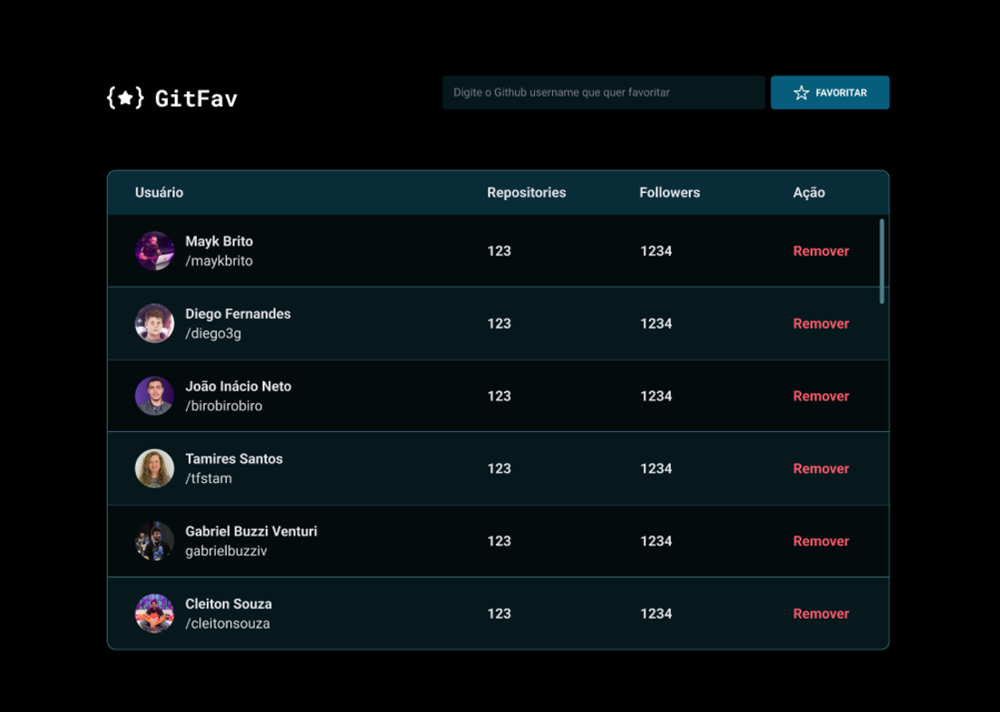

<h1 align="center"> :star: GitFav :star: </h1>

Este projeto foi desenvolvido no Stage 06 do Explorer, ampliando os conhecimentos em Promises!
Nele é possível adicionar/remover os perfis favoritos do seu GitHub e apresentá-los em uma tabela.

  

 

# 🚀 Tecnologias

As seguintes ferramentas foram usadas na construção do projeto:

 - HTML;
 - CSS;
 - JavaScript;
 - Github API.

 

💻 Você pode acessar [aqui](https://project-gitfav.vercel.app/)

 feito com ❤ por <a href="https://www.instagram.com/saulochristian_/" target="_blank">@saulochristian</a>

